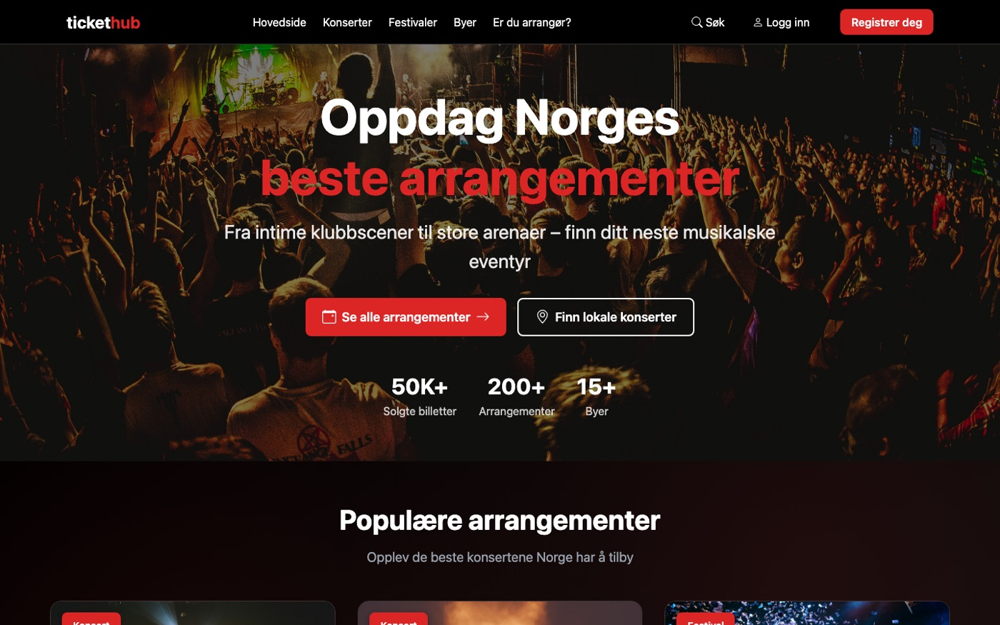
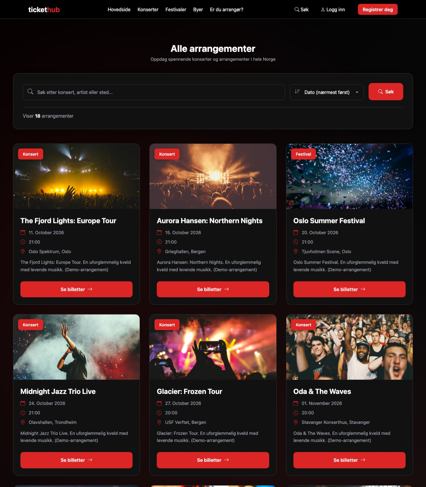
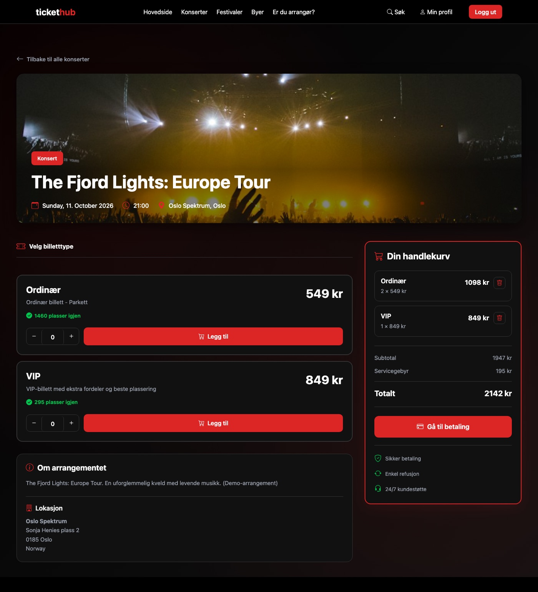
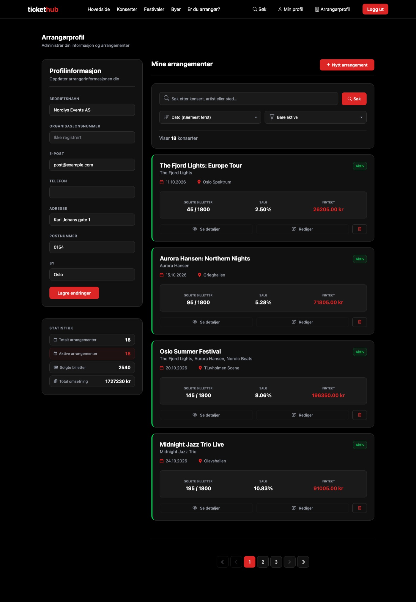
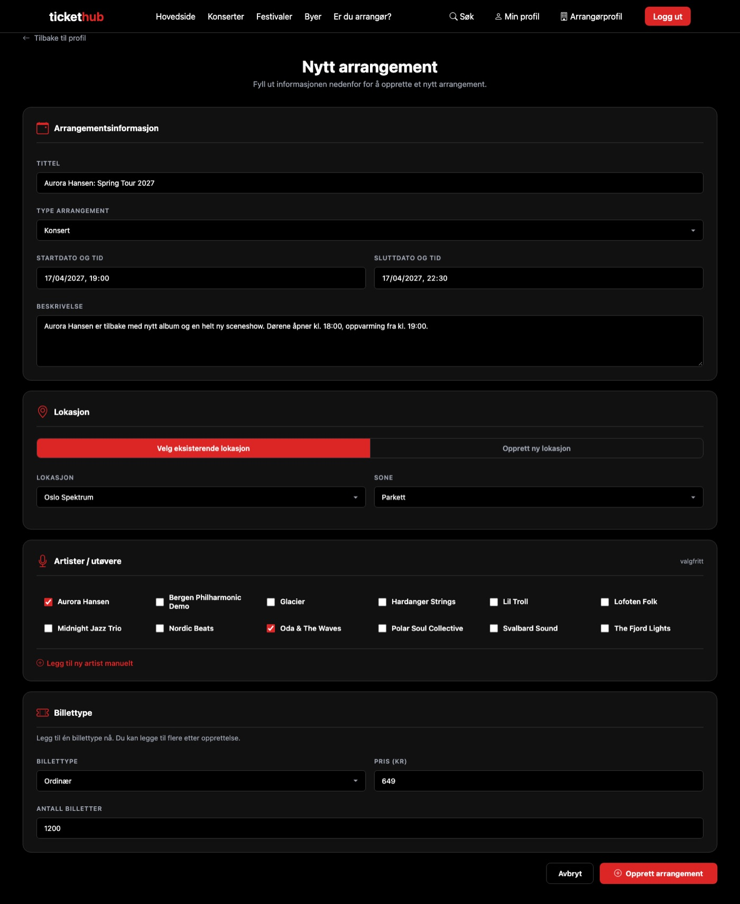
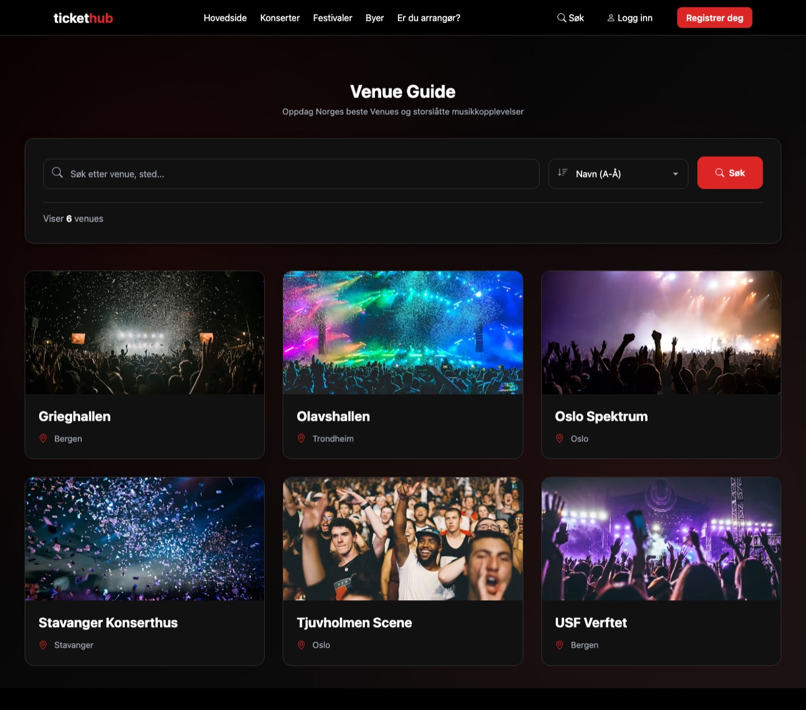
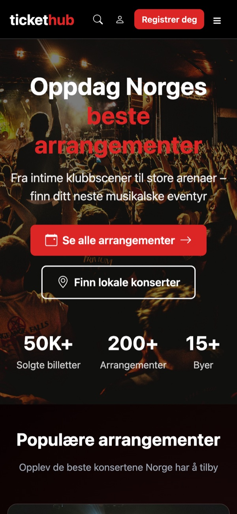
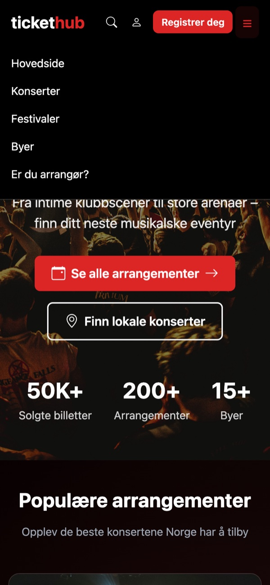
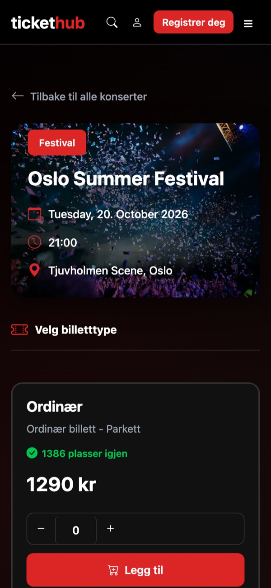

# TicketHub 🎟️

TicketHub is a ticketing website for concerts and festivals in Norway. We built it as a group project at school. Six of us worked on it for about a year (Aug 2025 to Sep 2026). It started as a simple event list and grew into a full site where you can browse events, buy tickets and manage your own events as an organizer.

The site is in Norwegian, since that was the target audience.



## What it can do

**For users**
- Browse concerts and festivals, search and sort by date
- Filter events by city and venue
- Pick ticket types (ordinary / VIP / student etc.), add them to a cart and "pay" (the payment is simulated)
- See your orders and tickets on your profile
- Register, log in, reset password by email

**For organizers**
- Organizer profile with an overview of your events, tickets sold and income
- Create and edit events: venue, date, performers and ticket types
- Choose an existing venue or create a new one while making the event

**Behind the scenes**
- Seated and standing tickets are handled differently (every seat is its own row in the database, standing tickets are just a counter per area)
- Finished events are automatically moved to archive tables (`python manage.py archive_expired_events`)
- A small REST API for events and cities made with Django REST Framework, see [docs/API.md](docs/API.md) (in Norwegian)

## Screenshots

The events, artists and organizer in the screenshots are made-up demo data (see `seed_demo` below).

### All events
Search, sort and browse all upcoming concerts and festivals.



### Buying tickets
Pick a ticket type and amount, the cart on the right updates with service fee and total.



### Organizer profile
Company info, statistics and a list of your own events with tickets sold, sales and income per event.



### Creating an event
Event info, venue (existing or new), performers and the first ticket type in one form.



### Venues



### Mobile
The site is responsive. Home page, the mobile menu and an event page on a phone:

<p align="center">
  
  &nbsp;
  
  &nbsp;
  
</p>

## Tech stack

- Python 3 / Django 5.2
- Django REST Framework
- SQLite for development
- Plain HTML templates, CSS and a bit of JavaScript (no frontend framework)
- Git + GitHub with a branch for each of us and a shared `develop` branch

## Running it locally

You need Python 3.10 or newer.

```bash
git clone https://github.com/nebedolagaa/tickethub-portfolio.git
cd tickethub-portfolio

python3 -m venv .venv
source .venv/bin/activate        # Windows: .venv\Scripts\activate

pip install -r requirements.txt
python manage.py migrate
python manage.py seed_demo       # adds some demo events and users
python manage.py runserver
```

Then open http://127.0.0.1:8000/.

**Demo users** (created by `seed_demo`, password `demo12345`):

| Email | Role |
|---|---|
| organizer@example.com | Organizer, can create and edit events |
| ola@example.com | Normal user, can buy tickets |

For the admin panel make your own superuser with `python manage.py createsuperuser` and go to `/admin/`.

Secrets like `DJANGO_SECRET_KEY` and the SMTP password are read from environment variables, see [.env.example](.env.example). You don't need them to run the project locally, but password reset emails won't be sent without them.

**Tests:**

```bash
python manage.py test
```

## Project structure

```text
config/    settings and main urls
events/    events, venues, performers, cities, archive, REST API
tickets/   ticket types, cart, orders and payment
users/     custom user model (login with email), user and organizer profiles
pages/     FAQ, contact, terms, privacy and other info pages
templates/ base template and shared snippets (header, footer, cards…)
static/    CSS and favicons
docs/      API docs and screenshots
```

## The team

| | Main areas |
|---|---|
| **Nikita** ([@nebedolagaa](https://github.com/nebedolagaa)) | Main frontend developer. Built most of the event pages and shared templates, fixed styling and UI bugs across the whole site. Also made the archive system and parts of the REST API |
| **Christoffer** ([@Christofferberg77](https://github.com/Christofferberg77)) | Ticket purchase flow, cart and checkout pages |
| **Kamilla** ([@kamazik0102](https://github.com/kamazik0102)) | User model and login, user and organizer profiles, creating/editing events |
| **Jesper** ([@jesper0202](https://github.com/jesper0202)) | Performer model, REST API, styling |
| **Magnus** ([@Magnusbot1](https://github.com/Magnusbot1)) | Payment and ticket views, test data |
| **Eskild** ([@EskSond](https://github.com/EskSond)) | Event listing and filtering, info pages, styling |

Of course a lot of things were done together, so the table is just a rough idea of who did what.

## What we learned

This was the first bigger project for most of us, and we made a lot of mistakes along the way:

- **Merge conflicts.** Six people working in the same templates and `main.css` was painful. Later we moved page-specific CSS into each app and got better at small commits.
- **Database design.** It took us a while to figure out how to model seated vs. standing tickets. Planning the models on paper first would have saved us a lot of back and forth.
- **Secrets in Git.** We committed passwords and the database file early on. The history in this repo has been cleaned up, and now everything sensitive comes from environment variables.
- **Tests.** We only really wrote tests for the REST API. Next time we want to write them earlier and for the purchase flow too.

## Status

The project was made for school and is not running in production. Payments are fake and no real tickets are sold 🙂
